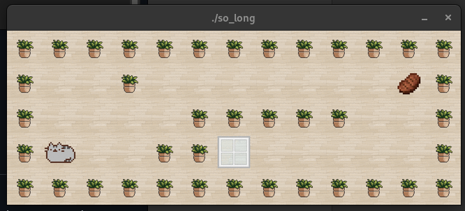

# Projet valide 🎮


## Description
 - Un petit jeu 2D avec la librairie graphique de 42 : la MiniLibX
 - Vous etes un chat qui arrivait d'un carton et vous devez partir de la piece apres avoir mange tous les steaks, en moins de coups possible. 
 - Page 12/12


## Keywords
 - programmation graphique

## Utilisation
### Compilation
```bash
make
```

### Execution avec map.ber, ou autre map
```bash
./so_long map/map.ber
```
