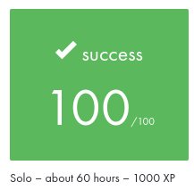

# Projet en cours 🕹

## Description
 - Un petit jeu 2D avec la librairie graphique de 42 : la MiniLibX
 - Un petit chat (character) part d'une piece (place) apres avoir mange quelques souris (collectible). 
 - Choix 
 - Page 7/11

## Keywords
 - programmation graphique

## To use
- [ ] a map description file in format *.ber
- [ ] open
- [ ] close
- [ ] read
- [ ] write
- [ ] malloc
- [ ] free
- [ ] perror
- [ ] strerror
- [ ] exit
- [ ] all functions of the math library (-lm compiler option, man man 3 math)
- [ ] functions of the mlx : the version on the school machines or by installing it using its sources
- [ ] ft_printf
- [ ] minilibx-linux.tgz
- [ ] minilibx_opengl.tgz
- [ ] minilibx_mms_20200219_beta.tgz
- [ ] https://itch.io/game-assets/free/tag-sprites
- [ ] In any case, ensure that you respect other people’s work -> mention ?
- [ ] tool to open (and close ?) a window, create images and deal with keyboard and mouse events
- [ ] textures
- [ ] **tiles**
- [ ] **tilesets**
- [ ] **sprites**
- [ ] **sprite sheets**
- [ ] colors

## To test
- [ ] make fclean
- [ ] headers 42
- [ ] norminette
- [ ] ? testeurs ?
- [ ] valgrind !!
- [ ] file names/git repo
- [ ] (guidelines -> tests)

## Utilisation
